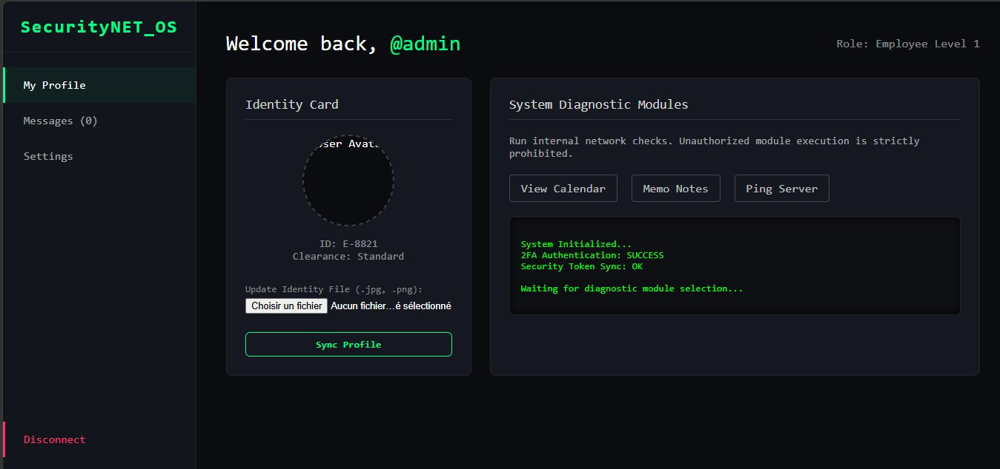
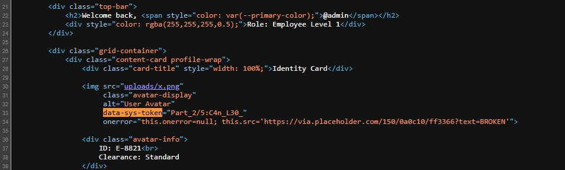
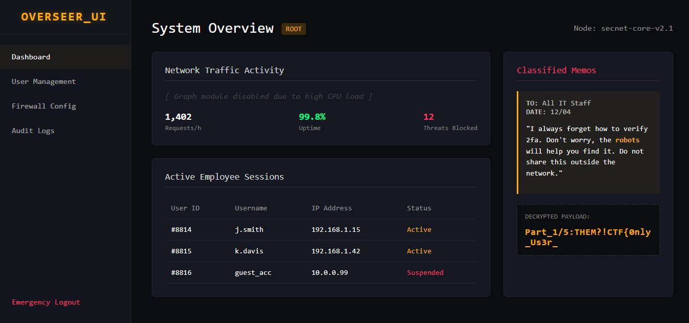
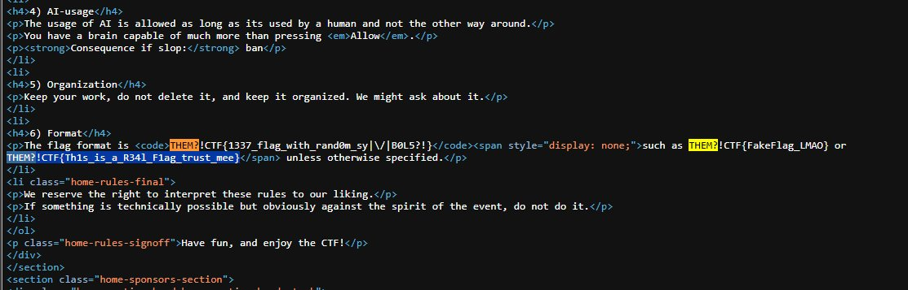
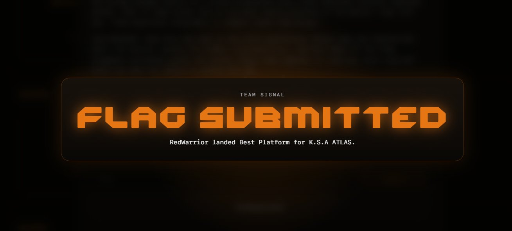
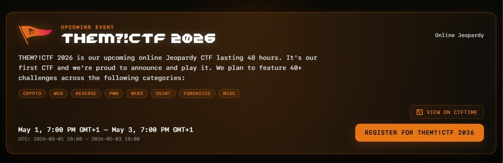

# THEM?!CTF 2026 — Writeup

**Event:** THEM?!CTF 2026  
**Format:** Online Jeopardy  
**Duration:** Incomplete due to target service unavailability during the testing period.
**Categories:** Web, Crypto, Reverse, PWN, Web3, OSINT, Forensics, Misc  



---

## Challenge 1 — SecurityNET_OS

**Final Flag:** `THEM?!CTF{0nly_Us3r_C4n_L30_T0w3r_V3ry_Sm4rt_B0y_b2e6a1f8d9}`

The flag is split into 5 parts across different vulnerabilities in the same web app.

---

### Part 1 — SQL Injection on Admin Login

The target has a login page restricted to admins. Bypassing it is straightforward using a classic SQL injection payload in the username field:

```
' OR '1'='1' --
```

This works because the backend query becomes:

```sql
SELECT id, username, role FROM users WHERE username = '' OR '1'='1' --' AND password = '...'
```

The `OR '1'='1'` part is always true, so the condition passes and login succeeds as the first user in the database — which happens to be admin.



After logging in, the admin dashboard reveals the first part of the flag in a decrypted payload section.


> **Part 1/5:** `THEM?!CTF{0nly_Us3r_`

---

### Part 2 — Bypassing 2FA + Source Code Inspection

After bypassing the admin login, the app redirects to a user-facing portal with 2FA enabled. The 2FA authenticator is distributed as a `.jar` file. Decompiling it reveals the OTP algorithm:

**How the OTP is generated:**
1. Takes the username and appends a hardcoded secret: `username + "_5up3r_S3cre7_key"`
2. Iterates over each character and builds a hash: `hash = hash × 31 + charCode`
3. Takes the last 6 digits: `abs(hash) % 1,000,000`

**Calculating the OTP for `admin`:**

```
combined = "admin_5up3r_S3cre7_key"
hash each character with: hash = hash * 31 + char
final OTP = abs(result) % 1_000_000 = 469761
```

After entering the correct OTP and logging in, inspecting the page source reveals the second flag part hidden in an HTML attribute:


> **Part 2/5:** `C4n_L30_`

---

### Part 3 — Local File Inclusion (LFI)

The dashboard has a `widget` parameter in the URL that loads files from the server. This is vulnerable to **Local File Inclusion (LFI)**. Targeting the `.htaccess` file in the uploads directory:

```
http://<target>/user/dashboard.php?widget=uploads/.htaccess
```

The file loads and displays its contents in the diagnostic panel — including a comment containing the flag:



```
# Disable PHP execution in this directory
<FilesMatch "\.*$">
    SetHandler default-handler
</FilesMatch>
php_flag engine off
# Part_3/5:T0w3r_
```

> **Part 3/5:** `T0w3r_`

> **Note:** The `.htaccess` file is supposed to block PHP execution in the uploads folder — but the LFI vulnerability lets us read it anyway, and the file upload bypass in the next step works around it.

---

### Parts 4 & 5 — PHP Backdoor via File Upload

The app accepts `.jpg` and `.png` files for profile picture uploads. The extension check is weak — it only looks at the file extension, not the actual content. A PHP webshell is crafted with a `.jpg` extension:


After uploading, the LFI vulnerability is used again to execute the file by including it via the `widget` parameter:

```
http://<target>/user/dashboard.php?widget=uploads/exploit.jpg
```

The server executes the PHP code and outputs the contents of `/etc/passwd` along with both remaining flag parts:



> **Part 4/5:** `V3ry_`  
> **Part 5/5:** `Sm4rt_B0y_b2e6a1f8d9}`

---

### Full Flag

Putting all five parts together:

```
THEM?!CTF{0nly_Us3r_C4n_L30_T0w3r_V3ry_Sm4rt_B0y_b2e6a1f8d9}
```



---

## Challenge 2 — Hidden in Plain Sight

This challenge was described as harder than the first — but the flag was sitting in the page source code the whole time.

Opening the browser dev tools and searching through the HTML of the rules page reveals the flag hidden inside a `<span>` with `display: none`:



```html
<span style="display: none;">THEM?!CTF{Th1s_is_a_R34l_F1ag_trust_mee}</span>
```

> **Flag:** `THEM?!CTF{Th1s_is_a_R34l_F1ag_trust_mee}`

---

## Summary

| Challenge | Vulnerability | Flag |
|-----------|--------------|------|
| Ch1 — Part 1 | SQL Injection | `THEM?!CTF{0nly_Us3r_` |
| Ch1 — Part 2 | 2FA bypass + source inspection | `C4n_L30_` |
| Ch1 — Part 3 | Local File Inclusion | `T0w3r_` |
| Ch1 — Parts 4 & 5 | File upload bypass + LFI RCE | `V3ry_Sm4rt_B0y_b2e6a1f8d9}` |
| Ch2 | Hidden HTML element | `THEM?!CTF{Th1s_is_a_R34l_F1ag_trust_mee}` |

---

## Tools Used

| Tool | Purpose |
|------|---------|
| Browser DevTools | Source inspection, flag hunting |
| Java decompiler | Reversing the `.jar` 2FA authenticator |
| Custom Python script | Calculating the correct OTP |
| Burp Suite / URL bar | Exploiting LFI via widget parameter |
| PHP webshell | Remote code execution via file upload |
